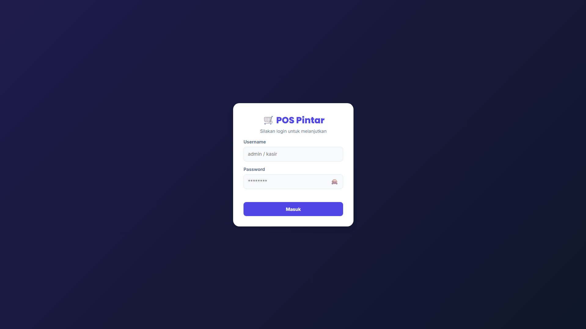
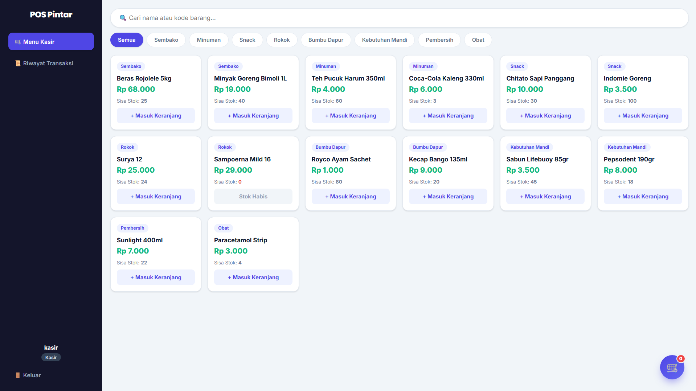
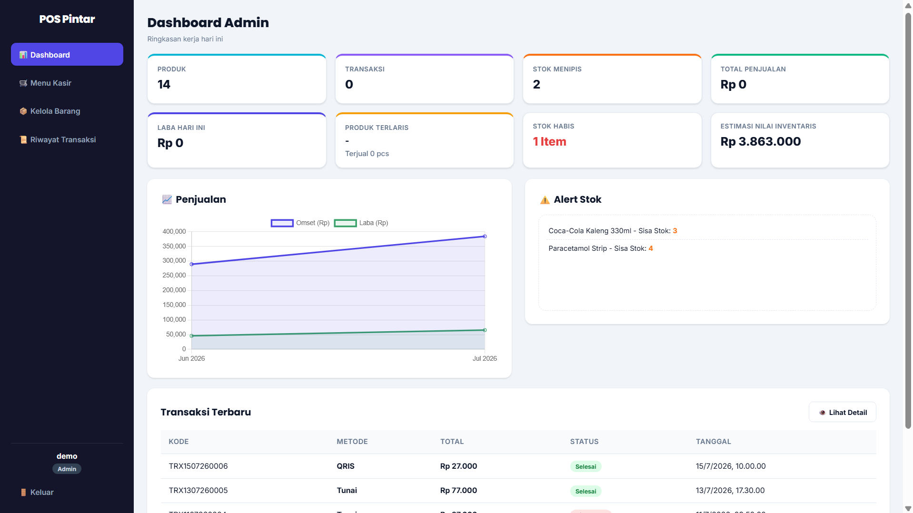

<div align="center">

# 🛒 POS Pintar
### Sistem Kasir & Manajemen Toko Digital

**Kelola toko lebih mudah, lebih rapi, lebih profesional.**

[](https://kasirpintar-bice.vercel.app/)
[](https://www.google.com/script/start/)
[](https://www.google.com/sheets/about/)
[](https://vercel.com)

</div>

---

## 📌 Tentang POS Pintar

**POS Pintar** adalah aplikasi kasir (Point of Sale) untuk toko kelontong/retail skala kecil-menengah yang dirancang membantu pemilik toko mengelola bisnis secara digital — dari transaksi harian, stok barang, hingga laporan keuangan, semua dalam satu dashboard yang simpel dan profesional.

> Tidak perlu lagi catatan manual, tidak ada lagi stok yang salah hitung, tidak ada lagi laporan yang berantakan.

---

## ✨ Fitur Utama

- 🔐 **Autentikasi & Role** — Login dengan dua role: Admin dan Kasir
- 🛍️ **Menu Kasir** — Katalog produk dengan foto, kategori bubble, pencarian & sort real-time
- 💳 **Multi Metode Pembayaran** — Tunai, Transfer Bank (no. rekening otomatis tampil), QRIS (QR + total tagihan otomatis tampil)
- 📦 **Manajemen Produk** — Foto produk, kategori & satuan sebagai master data, konversi satuan besar↔ecer
- 🚨 **Reminder Stok** — Batas stok minimum kustom per produk
- 🧾 **Riwayat Transaksi** — Cetak struk thermal, void/batalkan transaksi (stok otomatis kembali)
- 📊 **Dashboard Ringkasan** — Omset & laba harian, grafik bulanan, peringatan stok menipis
- 🌐 **Tampilan Bahasa Indonesia** — Seluruh antarmuka dalam Bahasa Indonesia
- 💰 **Format Rupiah** — Mata uang otomatis dalam format Rp
- 📱 **Ramah Pengguna** — Mobile-first, tetap rapi di Desktop

---

## 🖥️ Screenshot

| Halaman Login | Menu Kasir |
|---|---|
|  |  |

| Dashboard Admin |
|---|
|  |

---

## 🛠️ Tech Stack

| Teknologi | Kegunaan |
|---|---|
| [Google Apps Script](https://www.google.com/script/start/) | Backend & server-side logic |
| HTML, CSS, JavaScript | Frontend (Index.html, Style.html, Script.html) |
| [Google Sheets](https://www.google.com/sheets/about/) | Database (Produk, Transaksi, Kategori, Satuan) |
| [Google Drive](https://drive.google.com) | Penyimpanan foto produk |
| [Chart.js](https://www.chartjs.org) | Grafik omset & laba |
| [Vercel](https://vercel.com) | Hosting wrapper (menyembunyikan URL Apps Script) |

---

## 🚀 Cara Menjalankan / Deploy Sendiri

### Prasyarat
- Akun Google (gratis)
- Akun [Vercel](https://vercel.com) (gratis)

### 1. Clone Repository

```bash
git clone https://github.com/ianndmt1/ProjectMagang/tree/main/POS
cd POS
```

### 2. Setup Google Sheets (Database)

Buat 1 spreadsheet baru dengan 4 sheet berikut:

| Sheet | Kolom (header baris 1) |
|---|---|
| **Produk** | `ID_Barang`, `Nama_Barang`, `Kategori`, `Harga_Modal`, `Harga_Jual`, `Stok`, `FotoURL`, `MinStok`, `SatuanBesar`, `SatuanEcer`, `Konversi` |
| **Transaksi** | `ID_Transaksi`, `Tanggal`, `Item_Terjual`, `Total_Harga`, `Total_Laba`, `Uang_Bayar`, `Uang_Kembali`, `Metode`, `Status` |
| **Kategori** | `ID_Kategori`, `Nama_Kategori` |
| **Satuan** | `ID_Satuan`, `Nama_Satuan`, `Tipe` |

### 3. Deploy Apps Script

1. Di spreadsheet tadi, buka **Ekstensi → Apps Script**
2. Buat file: `Code.gs`, `Index.html`, `Style.html`, `Script.html`
3. Copy-paste isi dari `Beranda.html` (repo ini) → `Index.html` di editor, dan sisanya sesuai nama
4. Klik **Deploy → New deployment** → tipe **Web app**
   - Execute as: **Me**
   - Who has access: **Anyone**
5. Salin URL `.../exec` yang muncul

### 4. Deploy Wrapper ke Vercel

```bash
git add .
git commit -m "initial commit"
git push origin main
```

1. Buka [vercel.com](https://vercel.com) → **Add New Project**
2. Import repository POS dari GitHub
3. Di `index.html`, ganti `src` iframe dengan URL `.../exec` dari langkah sebelumnya
4. Klik **Deploy** 🚀

---

## ⚙️ Konfigurasi

Ganti kredensial & data pembayaran sebelum dipakai serius:

**Di `Code.gs`:**
```javascript
var AKUN_LOGIN = {
  "admin": { password: "GANTI_PASSWORD_ADMIN", role: "admin" },
  "kasir": { password: "GANTI_PASSWORD_KASIR", role: "kasir" }
};
```

**Di `Script.html`:**
```javascript
var QRIS_IMAGE_URL = "URL_GAMBAR_QRIS_TOKO_ANDA";
var BANK_NAMA = "Nama Bank Anda";
var BANK_NOREK = "Nomor Rekening Anda";
var BANK_ATASNAMA = "Nama Toko Anda";
```

---

## 👥 Role & Akses

| Role | Akses |
|---|---|
| **Admin** | Dashboard, Menu Kasir, Kelola Barang, Riwayat Transaksi (+ void), Kelola Kategori & Satuan |
| **Kasir** | Menu Kasir, Riwayat Transaksi (lihat saja) |

### Akun Demo

| Role | Username | Password |
|---|---|---|
| Admin | `demo` | `demo2026` |
| Kasir | `kasir` | `kasir123` |

> ⚠️ Ini akun **demo publik** di [kasirpintar-bice.vercel.app](https://kasirpintar-bice.vercel.app/) — data yang dimasukkan bisa dilihat/diubah pengguna lain yang mencoba demo ini juga. Jangan gunakan data asli. Untuk pemakaian produksi, deploy versi sendiri mengikuti langkah di atas dan ganti kredensial login.

---

## 📁 Struktur Project

```
POS/
├── index.html      # Entry point yang di-deploy Vercel (berisi <iframe> ke Apps Script)
├── vercel.json     # Konfigurasi header Vercel (opsional)
├── Beranda.html    # Backup kode — halaman utama Apps Script (setara Index.html di editor)
├── Style.html      # Backup kode — seluruh CSS aplikasi
├── Script.html     # Backup kode — seluruh JavaScript aplikasi
├── Code.gs         # Backup kode — seluruh backend/server-side (Apps Script)
└── README.md       # Dokumentasi ini
```

> File `Beranda.html`, `Style.html`, `Script.html`, `Code.gs` di repo ini hanya backup/histori kode. File yang benar-benar dijalankan tetap ada di **Apps Script Editor** milik Google Sheets — bukan dieksekusi dari GitHub/Vercel.

---

## 🗺️ Roadmap

- [x] Autentikasi & role (Admin & Kasir)
- [x] Menu kasir & multi metode pembayaran
- [x] Manajemen produk, kategori, satuan
- [x] Dashboard & grafik
- [x] Void transaksi
- [ ] Manajemen supplier
- [ ] Cetak label harga/barcode massal
- [ ] Grafik perbandingan periode
- [ ] Backup otomatis database
- [ ] Log aktivitas admin

---

<div align="center">

Dibuat dengan ❤️ untuk kebutuhan toko kelontong sehari-hari

⭐ Jangan lupa beri bintang jika project ini membantu!

</div>
