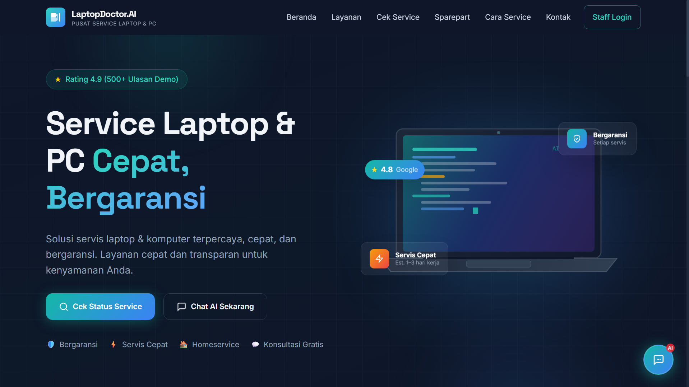
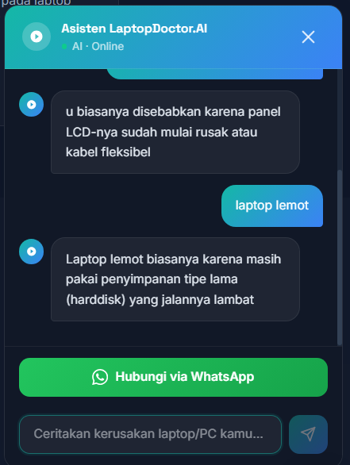
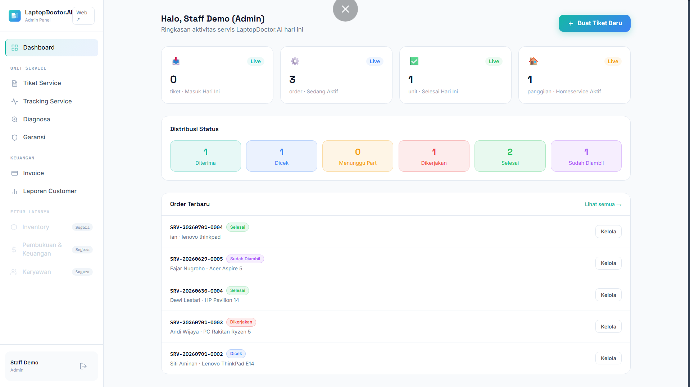
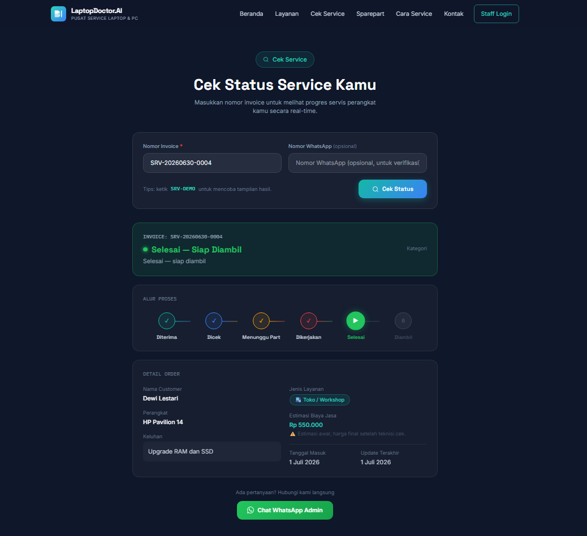

<div align="center">

# 🩺 LaptopDoctor.AI
### Sistem Manajemen Servis Laptop, Komputer & Sparepart Berbasis AI

**Diagnosa lebih cepat, servis lebih rapi, pelanggan lebih tenang.**

[](https://lapdoct.vercel.app)
[](https://nextjs.org)
[](https://supabase.com)
[](https://ai.google.dev)
[](https://vercel.com)

</div>

---

## 📌 Tentang LaptopDoctor.AI

**LaptopDoctor.AI** adalah aplikasi web manajemen servis laptop, komputer, dan sparepart yang dilengkapi **asisten AI** untuk membantu pelanggan mendiagnosa kerusakan sebelum datang servis, sekaligus dashboard admin untuk mengelola seluruh alur tiket servis secara digital — dari unit masuk sampai siap diambil.

> Tidak perlu lagi catatan servis di kertas, tidak ada lagi pelanggan yang bingung status unitnya sudah sampai mana, tidak ada lagi antrian WhatsApp yang bikin bingung mana yang sudah dibalas.

---

## ✨ Fitur Utama

- 🤖 **Chat AI Diagnosa** — Pelanggan cerita gejala kerusakan, AI (Google Gemini) bantu perkirakan penyebab & saran awal secara natural
- 🔎 **Cek Status Mandiri** — Pelanggan lacak status servis sendiri lewat nomor invoice, tanpa perlu bikin akun
- 🔐 **Autentikasi & Role Staff** — Login dengan tiga role: Admin, Kasir, dan Teknisi
- 🎫 **Manajemen Tiket Servis** — Input order baru, ubah status, catat diagnosa, garansi, dan status pembayaran
- 📍 **Tracking Service** — Visualisasi progress servis per status, dari Diterima sampai Sudah Diambil
- 🧾 **Invoice & WhatsApp** — Generate invoice dan link WhatsApp update status otomatis ke pelanggan
- 🛒 **Katalog Sparepart** — Etalase sparepart untuk pelanggan, transaksi diarahkan ke WhatsApp
- 📊 **Laporan Servis** — Rekap jumlah order, servis selesai, dan homeservice per bulan
- ⚙️ **Pengaturan Terpusat** — Nama toko, alamat, kontak, jam operasional diatur dari dashboard, tanpa edit kode
- 📱 **Ramah Pengguna** — Akses mudah dari Desktop maupun Mobile, termasuk chat AI dalam bentuk bottom sheet di HP

---

## 🖥️ Screenshot

| Landing Page | Chat AI |
|---|---|
|  |  |

| Dashboard Admin | Tracking Service |
|---|---|
|  |  |

---

## 🛠️ Tech Stack

| Teknologi | Kegunaan |
|---|---|
| [Next.js 14](https://nextjs.org) | Framework React untuk frontend & backend |
| [Tailwind CSS](https://tailwindcss.com) | Styling & desain UI |
| [Supabase](https://supabase.com) | Database PostgreSQL & autentikasi |
| [Google Gemini API](https://ai.google.dev) | Chat AI diagnosa & cek status servis |
| [TypeScript](https://typescriptlang.org) | Type safety |
| [Vercel](https://vercel.com) | Hosting & deployment |

---

## 🚀 Cara Menjalankan Lokal

### Prasyarat
- Node.js versi 18 atau lebih baru
- Akun [Supabase](https://supabase.com) (gratis)
- Akun [Google AI Studio](https://aistudio.google.com/apikey) (gratis, untuk API key Gemini)
- Akun [Vercel](https://vercel.com) (gratis)

### 1. Clone Repository

```bash
git clone https://github.com/username/laptopdoctor-ai.git
cd laptopdoctor-ai
```

### 2. Install Dependencies

```bash
npm install
```

### 3. Setup Environment Variables

Buat file `.env.local` di root project:

```env
NEXT_PUBLIC_SUPABASE_URL=https://xxxxxxxx.supabase.co
NEXT_PUBLIC_SUPABASE_ANON_KEY=eyJxxxxxxxxxxxxxxxx
SUPABASE_SERVICE_ROLE_KEY=eyJxxxxxxxxxxxxxxxx
GEMINI_API_KEY=AIzaxxxxxxxxxxxxxxxx
ADMIN_WHATSAPP_NUMBER=628123456789
```

> Lihat cara mendapatkan nilai ini di bagian [Setup Supabase](#️-setup-supabase) di bawah.

### 4. Jalankan Development Server

```bash
npm run dev
```

Buka [http://localhost:3000](http://localhost:3000) di browser.

---

## 🗄️ Setup Supabase

### 1. Buat Project Supabase
1. Daftar di [supabase.com](https://supabase.com)
2. Klik **New Project** → isi nama: `LaptopDoctorAI`
3. Pilih region: **Southeast Asia (Singapore)**
4. Tunggu project siap (~2 menit)

### 2. Ambil Kredensial
1. Buka **Settings → API**
2. Copy **Project URL** → masukkan ke `NEXT_PUBLIC_SUPABASE_URL`
3. Copy **anon public key** → masukkan ke `NEXT_PUBLIC_SUPABASE_ANON_KEY`
4. Copy **service_role key** → masukkan ke `SUPABASE_SERVICE_ROLE_KEY` (⚠️ rahasia, jangan expose ke client)

### 3. Buat Tabel Database
1. Buka **SQL Editor → New Query**
2. Jalankan seluruh file SQL di folder `/database` secara berurutan sesuai penomoran (`01_...sql`, `02_...sql`, dst)
3. Semua tabel, trigger, dan view akan otomatis terbuat ✅

### 4. Buat Akun Admin Pertama
```sql
insert into profiles (id, full_name, role, status)
select id, 'Nama Admin', 'admin', 'aktif'
from auth.users
where email = 'email-admin-kamu@contoh.com';
```

### 5. Dapatkan API Key Gemini
1. Buka [aistudio.google.com/apikey](https://aistudio.google.com/apikey)
2. Klik **Create API Key** → pilih buat project baru
3. Copy key → masukkan ke `GEMINI_API_KEY`

---

## ☁️ Deploy ke Vercel

### 1. Push ke GitHub
```bash
git add .
git commit -m "initial commit"
git push origin main
```

### 2. Import di Vercel
1. Buka [vercel.com](https://vercel.com) → **Add New Project**
2. Import repository LaptopDoctor.AI dari GitHub
3. Tambahkan **Environment Variables**:
   - `NEXT_PUBLIC_SUPABASE_URL`
   - `NEXT_PUBLIC_SUPABASE_ANON_KEY`
   - `SUPABASE_SERVICE_ROLE_KEY`
   - `GEMINI_API_KEY`
   - `ADMIN_WHATSAPP_NUMBER`
4. Centang semua environment: **Production, Preview, Development**
5. Klik **Deploy** 🚀

---

## 🔑 Environment Variables

| Variable | Deskripsi | Wajib |
|---|---|---|
| `NEXT_PUBLIC_SUPABASE_URL` | URL project Supabase | ✅ |
| `NEXT_PUBLIC_SUPABASE_ANON_KEY` | Anonymous key Supabase | ✅ |
| `SUPABASE_SERVICE_ROLE_KEY` | Service role key Supabase (server-only) | ✅ |
| `GEMINI_API_KEY` | API key Google Gemini untuk chat AI | ✅ |
| `ADMIN_WHATSAPP_NUMBER` | Nomor WhatsApp tujuan tombol kontak | ✅ |

---

## 👥 Role & Akses

| Role | Akses |
|---|---|
| **Admin** | Dashboard, Tiket Service, Tracking, Invoice, Laporan, Pengaturan, User Management |
| **Kasir** | Dashboard, Tiket Service, Tracking, Invoice, Pembayaran |
| **Teknisi** | Dashboard, Tiket Service, Tracking, Diagnosa |

### Akun Demo
| Role | Email | Password |
|---|---|---|
| Admin | demo@laptopdoctor.ai | *(lihat tombol "Isi otomatis" di halaman login)* |

> Akun demo bersifat publik untuk keperluan uji coba — mohon tidak mengubah data secara permanen.

---

## 📁 Struktur Project

```
laptopdoctor-ai/
├── app/
│   ├── page.tsx              # Landing page
│   ├── cek-status/           # Cek status servis publik
│   ├── sparepart/            # Katalog sparepart
│   ├── admin/
│   │   ├── login/            # Halaman login staff
│   │   ├── tiket/            # Manajemen tiket servis
│   │   ├── tracking/         # Tracking service
│   │   ├── invoice/          # Invoice & pembayaran
│   │   └── reports/          # Laporan servis
│   └── api/                  # Route handler (publik & admin)
├── components/
│   ├── landing/               # Komponen landing page
│   ├── chat-widget/           # Chat AI
│   ├── admin/                 # Komponen dashboard admin
│   └── layout/                # Header/footer bersama
├── lib/
│   ├── supabase/              # Konfigurasi Supabase (server & client)
│   ├── auth/                  # Helper autentikasi & role
│   ├── gemini.ts              # Konfigurasi Gemini AI
│   └── settings.ts            # Pengambilan data toko dari database
├── database/                  # Script SQL migrasi Supabase, urut sesuai nomor
└── .env.local                 # Environment variables (tidak di-commit)
```

---

## 🗺️ Roadmap

- [x] Landing page & informasi layanan
- [x] Chat AI diagnosa kerusakan (Google Gemini)
- [x] Cek status servis mandiri via invoice
- [x] Autentikasi & role staff (Admin, Kasir, Teknisi)
- [x] Manajemen tiket & tracking servis
- [x] Invoice, garansi, dan status pembayaran
- [x] Laporan servis bulanan
- [ ] Modul Inventory (stok masuk/keluar sparepart)
- [ ] Modul Pembukuan & Laporan Keuangan
- [ ] Modul Karyawan (Absensi & Jadwal Kerja)
- [ ] Notifikasi WhatsApp otomatis (WhatsApp Business API)
- [ ] Multi-tenant (satu sistem untuk banyak toko sekaligus)

---

<div align="center">

Dibuat dengan ❤️ menggunakan vibe coding

⭐ Jangan lupa beri bintang jika project ini membantu!

</div>
