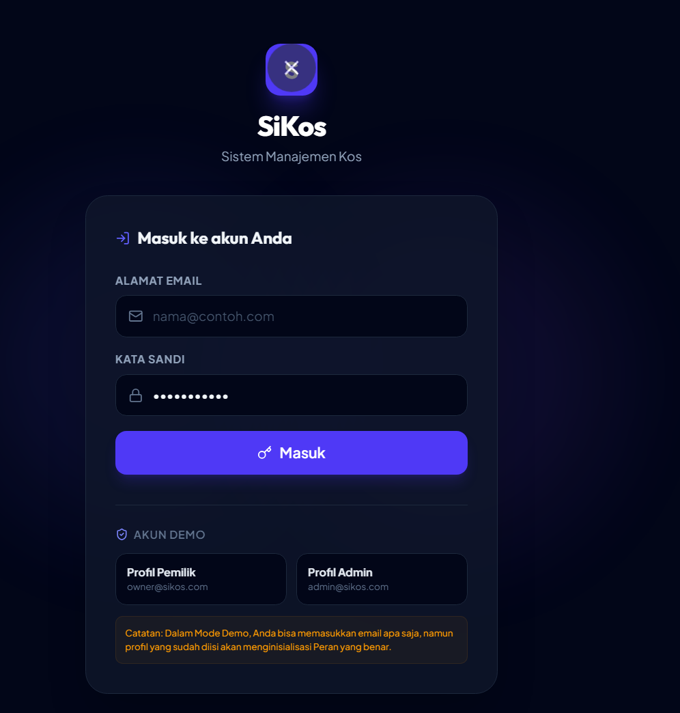
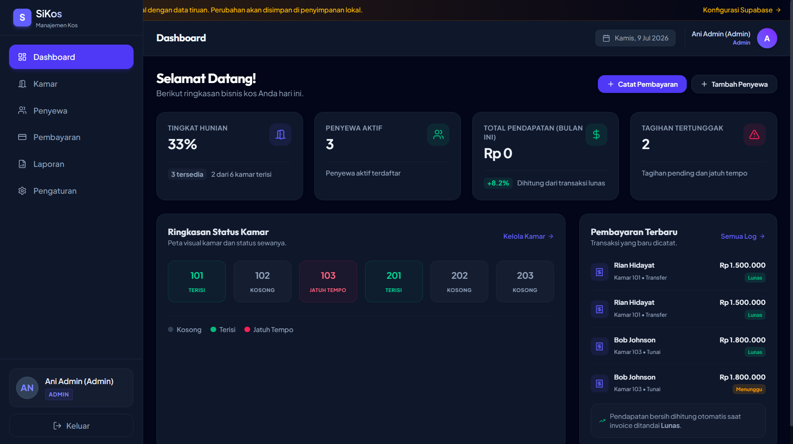
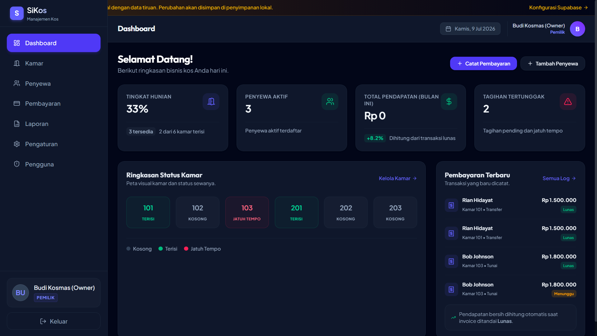

<div align="center">

# 🏠 SiKos
### Sistem Manajemen Kos Digital

**Kelola kos lebih mudah, lebih rapi, lebih profesional.**

[](https://si-kos.vercel.app)
[](https://nextjs.org)
[](https://supabase.com)
[](https://vercel.com)

</div>

---

## 📌 Tentang SiKos

**SiKos** adalah aplikasi web manajemen kos modern yang dirancang untuk membantu pemilik kos mengelola bisnis mereka secara digital — dari pencatatan penyewa, pembayaran, hingga laporan keuangan, semua dalam satu dashboard yang simpel dan profesional.

> Tidak perlu lagi catatan manual, tidak ada lagi tagihan yang terlewat, tidak ada lagi data penyewa yang hilang.

---

## ✨ Fitur Utama

- 🔐 **Autentikasi & Role** — Login dengan dua role: Pemilik (Owner) dan Admin
- 🚪 **Manajemen Kamar** — Tambah, edit, hapus kamar dengan status real-time (Terisi / Kosong / Jatuh Tempo)
- 👤 **Manajemen Penyewa** — Data penyewa lengkap, terhubung langsung ke kamar
- 💳 **Pencatatan Pembayaran** — Dukung pembayaran Tunai & Transfer, sewa Harian & Bulanan
- 📊 **Dashboard Ringkasan** — Tingkat hunian, total pendapatan, tagihan tertunggak
- 📈 **Laporan Keuangan** — Rekap pemasukan dan pengeluaran per periode
- 🌐 **Tampilan Bahasa Indonesia** — Seluruh antarmuka dalam Bahasa Indonesia
- 💰 **Format Rupiah** — Mata uang otomatis dalam format Rp

---

## 🖥️ Screenshot

| Halaman Login | Dashboard Admin |
|---|---|
|  |  |

| Dashboard Pemilik |
|---|
|  |

---

## 🛠️ Tech Stack

| Teknologi | Kegunaan |
|---|---|
| [Next.js 14](https://nextjs.org) | Framework React untuk frontend & backend |
| [Tailwind CSS](https://tailwindcss.com) | Styling & desain UI |
| [Supabase](https://supabase.com) | Database PostgreSQL & autentikasi |
| [TypeScript](https://typescriptlang.org) | Type safety |
| [Vercel](https://vercel.com) | Hosting & deployment |

---

## 🚀 Cara Menjalankan Lokal

### Prasyarat
- Node.js versi 18 atau lebih baru
- Akun [Supabase](https://supabase.com) (gratis)
- Akun [Vercel](https://vercel.com) (gratis)

### 1. Clone Repository

```bash
git clone https://github.com/username/sikoskos.git
cd sikoskos
```

### 2. Install Dependencies

```bash
npm install
```

### 3. Setup Environment Variables

Buat file `.env.local` di root project:

```env
NEXT_PUBLIC_SUPABASE_URL=https://xxxxxxxx.supabase.co
NEXT_PUBLIC_SUPABASE_ANON_KEY=eyJxxxxxxxxxxxxxxxx
```

> Lihat cara mendapatkan nilai ini di bagian [Setup Supabase](#-setup-supabase) di bawah.

### 4. Jalankan Development Server

```bash
npm run dev
```

Buka [http://localhost:3000](http://localhost:3000) di browser.

---

## 🗄️ Setup Supabase

### 1. Buat Project Supabase
1. Daftar di [supabase.com](https://supabase.com)
2. Klik **New Project** → isi nama: `sikoskos`
3. Pilih region: **Southeast Asia (Singapore)**
4. Tunggu project siap (~2 menit)

### 2. Ambil Kredensial
1. Buka **Settings → API**
2. Copy **Project URL** → masukkan ke `NEXT_PUBLIC_SUPABASE_URL`
3. Copy **anon public key** → masukkan ke `NEXT_PUBLIC_SUPABASE_ANON_KEY`

### 3. Buat Tabel Database
1. Buka **SQL Editor → New Query**
2. Copy & paste isi file `schema.sql` yang ada di root project
3. Klik **Run**
4. Semua tabel akan otomatis terbuat ✅

---

## ☁️ Deploy ke Vercel

### 1. Push ke GitHub
```bash
git add .
git commit -m "initial commit"
git push origin main
```

### 2. Import di Vercel
1. Buka [vercel.com](https://vercel.com) → **Add New Project**
2. Import repository SiKos dari GitHub
3. Tambahkan **Environment Variables**:
   - `NEXT_PUBLIC_SUPABASE_URL`
   - `NEXT_PUBLIC_SUPABASE_ANON_KEY`
4. Centang semua environment: **Production, Preview, Development**
5. Klik **Deploy** 🚀

---

## 🔑 Environment Variables

| Variable | Deskripsi | Wajib |
|---|---|---|
| `NEXT_PUBLIC_SUPABASE_URL` | URL project Supabase | ✅ |
| `NEXT_PUBLIC_SUPABASE_ANON_KEY` | Anonymous key Supabase | ✅ |

---

## 👥 Role & Akses

| Role | Akses |
|---|---|
| **Pemilik (Owner)** | Dashboard, Kamar, Penyewa, Pembayaran, Laporan, Pengaturan, Pengguna |
| **Admin** | Dashboard, Kamar, Penyewa, Pembayaran, Laporan, Pengaturan |

### Akun Demo
| Role | Email | Password |
|---|---|---|
| Pemilik | owner@sikos.com | password123 |
| Admin | admin@sikos.com | password123 |

---

## 📁 Struktur Project

```
SiKos/
├── app/
│   ├── (dashboard)/
│   │   ├── dashboard/     # Halaman dashboard
│   │   ├── rooms/         # Manajemen kamar
│   │   ├── tenants/       # Manajemen penyewa
│   │   ├── payments/      # Pembayaran
│   │   ├── reports/       # Laporan keuangan
│   │   ├── settings/      # Pengaturan
│   │   └── user-management/ # Manajemen pengguna
│   └── login/             # Halaman login
├── components/            # Komponen UI reusable
├── lib/
│   └── supabase.ts        # Konfigurasi Supabase
├── public/                # Aset statis
├── schema.sql             # Script database Supabase
└── .env.local             # Environment variables (tidak di-commit)
```

---

## 🗺️ Roadmap

- [x] Autentikasi & role (Owner & Admin)
- [x] Manajemen kamar
- [x] Manajemen penyewa
- [x] Pencatatan pembayaran
- [x] Dashboard & laporan
- [ ] Reminder email jatuh tempo
- [ ] Tagihan PDF otomatis
- [ ] Notifikasi WhatsApp
- [ ] Multi cabang
- [ ] Perpanjangan sewa otomatis

---

## 📄 Lisensi

Project ini menggunakan lisensi [MIT](LICENSE).

---

<div align="center">

Dibuat dengan ❤️ menggunakan vibe coding

⭐ Jangan lupa beri bintang jika project ini membantu!

</div>
