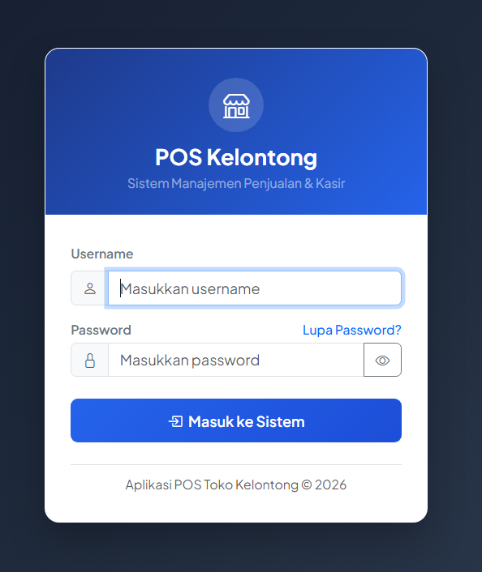
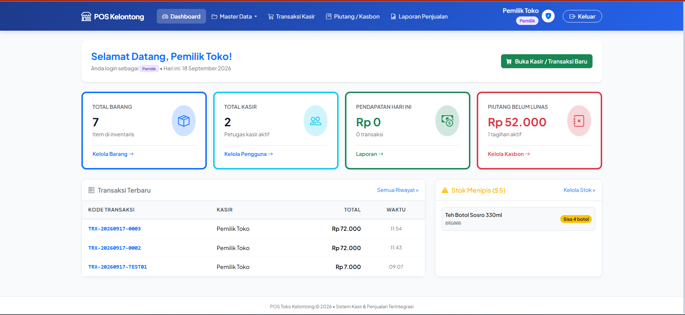
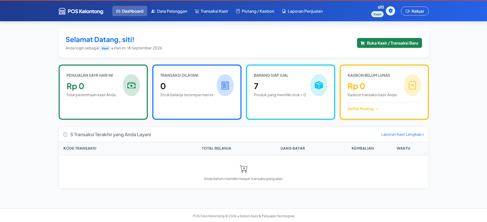

<div align="center">

# 🛒 POS Kelontong
### Aplikasi Kasir untuk Toko Kelontong

**Transaksi cepat, stok terkontrol, laporan rapi — semua dalam satu aplikasi.**

[](https://www.php.net/)
[](https://www.mysql.com/)
[](https://getbootstrap.com/)
[](https://www.apachefriends.org/)

</div>

---

## 📌 Tentang POS Kelontong

**POS Kelontong** adalah aplikasi kasir (Point of Sale) berbasis web untuk toko kelontong dengan dua peran pengguna: **Pemilik** dan **Kasir**. Dibangun dengan PHP native dan MySQL, aplikasi ini menangani transaksi harian, stok barang, piutang pelanggan, hingga laporan penjualan dalam satu sistem yang ringan dan mudah dijalankan di server lokal (XAMPP).

> Catat transaksi lebih cepat, stok berkurang otomatis, laporan tinggal cetak.

---

## ✨ Fitur Utama

- 🔐 **Autentikasi & Role** — Login dengan password ter-hash, dua role: Pemilik dan Kasir
- 🛍️ **Transaksi Kasir** — Pencarian barang real-time via AJAX, keranjang belanja dinamis, hitung kembalian otomatis
- 📦 **Master Data** *(khusus Pemilik)* — Kelola barang, kategori, pengguna, dan pelanggan
- 🧾 **Struk & Cetak** — Cetak struk transaksi (layout khusus print)
- 💳 **Piutang** — Catat dan bayar piutang pelanggan
- 📊 **Dashboard Ringkasan** — Total barang, total kasir, pendapatan hari ini
- 📈 **Laporan** — Kasir melihat transaksi miliknya hari ini; Pemilik melihat semua transaksi dengan filter tanggal
- 🌐 **Tampilan Bahasa Indonesia** — Seluruh antarmuka dalam Bahasa Indonesia
- 📱 **Responsif** — Tampilan Bootstrap 5, rapi di desktop maupun mobile

---

## 🖥️ Screenshot

| Halaman Login | Dashboard Pemilik |
|---|---|
|  |  |

| Dashboard kasir |
|---|
|  |

---

## 🛠️ Tech Stack

| Teknologi | Kegunaan |
|---|---|
| PHP Native (MySQLi, prepared statements) | Backend & server-side logic |
| [MySQL / MariaDB](https://www.mysql.com/) | Database |
| [Bootstrap 5](https://getbootstrap.com/) | UI framework |
| Vanilla JS / jQuery | Interaksi kasir (AJAX) |
| [XAMPP](https://www.apachefriends.org/) | Local server environment |

---

## 🚀 Cara Menjalankan / Instalasi

### Prasyarat
- [XAMPP](https://www.apachefriends.org/) (Apache + MySQL/MariaDB + PHP 8+)
- Ekstensi `mysqli` aktif di `php.ini`

### 1. Clone / Salin Project

```bash
git clone https://github.com/ianndmt1/ProjectMagang/tree/main/pos-kelontong
```

Salin folder `pos-kelontong` ke dalam `htdocs/` XAMPP.

### 2. Setup Database

1. Buka phpMyAdmin, buat database baru bernama `pos_kelontong`
2. Import file `database/pos_kelontong.sql` ke database tersebut

### 3. Konfigurasi Koneksi

Sesuaikan kredensial di `config/database.php` bila perlu (default: host `localhost`, user `root`, password kosong):

```php
$db_host = 'localhost';
$db_user = 'root';
$db_pass = '';
$db_name = 'pos_kelontong';
```

### 4. Jalankan Aplikasi

Aktifkan Apache & MySQL di XAMPP, lalu akses:

```
http://localhost/pos-kelontong/
```

---

## 👥 Role & Akses

| Halaman | Pemilik | Kasir |
|---|:---:|:---:|
| Login/Logout | ✅ | ✅ |
| Dashboard | ✅ | ✅ (ringkas) |
| Master Pengguna | ✅ | ❌ |
| Master Barang / Kategori / Pelanggan | ✅ | ❌ |
| Transaksi | ✅ | ✅ |
| Laporan | ✅ (semua) | ✅ (hanya hari ini) |
| Piutang | ✅ | ✅ |

### Akun Demo

| Role | Username | Password |
|---|---|---|
| Pemilik | `pemilik` | `pemilik123` |
| Kasir | `kasir2` | `kasir123` |

> ⚠️ Ini akun demo bawaan. Jangan gunakan untuk data produksi — segera ganti password melalui menu **Master Pengguna** (atau update langsung hash password di tabel `users`) setelah deploy.

---

## 📁 Struktur Project

```
pos-kelontong/
├── auth/            # login, logout, cek_session, lupa_password, profil
├── config/          # database.php — konfigurasi koneksi terpusat
├── dashboard/       # ringkasan statistik
├── database/        # pos_kelontong.sql — skema & data awal
├── laporan/         # daftar & detail laporan transaksi
├── master/          # pengguna, barang, kategori, pelanggan
├── piutang/         # daftar, detail, pembayaran piutang
├── transaksi/       # kasir (POS), proses AJAX, cetak struk
├── template/        # header & footer bersama
├── assets/          # css & js
└── index.php        # entry point, redirect ke login/dashboard
```

---

## 🗄️ Skema Database

- **users** — id, username, password (hash), nama_lengkap, role (`pemilik`/`kasir`), created_at
- **kategori** — id, nama_kategori
- **barang** — id, kode_barang, id_kategori (FK), nama_barang, harga_beli, harga_jual, stok, satuan, created_at, updated_at
- **transaksi** — id, kode_transaksi, id_kasir (FK users), total_belanja, uang_bayar, kembalian, created_at
- **transaksi_detail** — id, id_transaksi (FK), id_barang (FK), nama_barang, harga_satuan, jumlah, subtotal

---

## 🗺️ Roadmap

- [x] Autentikasi & role (Pemilik & Kasir)
- [x] Transaksi kasir dengan AJAX & kalkulasi real-time
- [x] Master data (barang, kategori, pengguna, pelanggan)
- [x] Dashboard ringkasan
- [x] Piutang pelanggan
- [x] Laporan & cetak struk
- [ ] CSRF token pada form
- [ ] Rate limiting login
- [ ] Soft-delete barang yang sudah ada di transaksi
- [ ] Export laporan ke Excel/PDF

---

<div align="center">

Dibuat dengan ❤️ untuk kebutuhan toko kelontong sehari-hari

⭐ Jangan lupa beri bintang jika project ini membantu!

</div>
